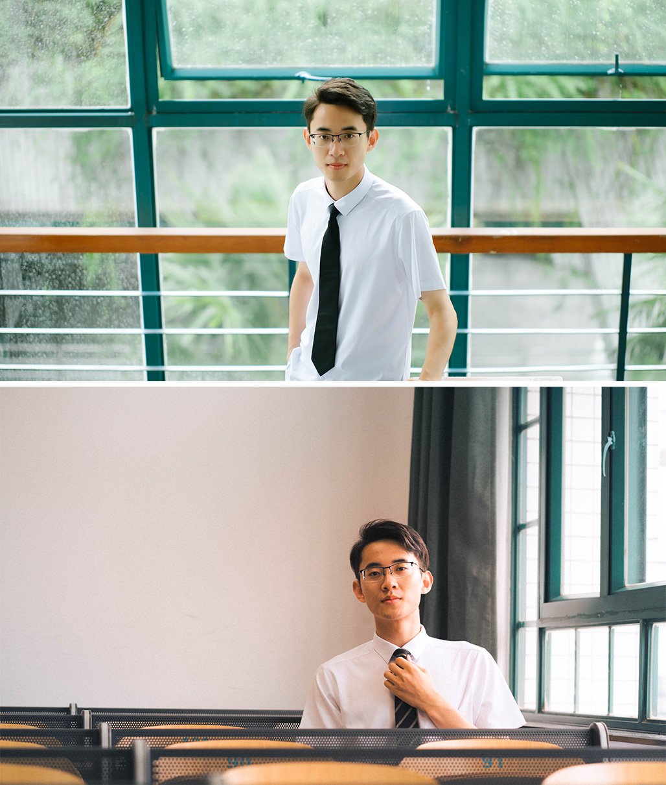

# About Me

 

  Here is **Naiyu Fang (房乃玉)**. 
- I was born in 1996 in Weifang, Shandong Province.
- I am a Research Fellow at [S-Lab](https://www.ntu.edu.sg/s-lab), [Nanyang Technological University](https://www.ntu.edu.sg/), researching with Prof. [Guosheng Lin](https://guosheng.github.io/)
- I got my PhD degree at [Zhejiang University](https://www.zju.edu.cn/english/), under the supervision of [Prof. Shuyou Zhang](https://person.zju.edu.cn/en/0092066) and [Prof. Lemiao Qiu](https://person.zju.edu.cn/en/english_my_freetown). Our research Group is affiliated to [State Key Lab of CAD&CG](http://www.cad.zju.edu.cn/english.html) and [the State Key Laboratory of Fluid Power & Mechatronic Systems](http://sklofp.zju.edu.cn/sklen/). 
- My reserach interest focuses on __Computer Vision__, __Autonomous Driving__, and __Virtual Try-on__.  

- You can contact me at naiyu.fang@ntu.edu.sg or FangNaiyu@zju.edu.cn

 

## Work Experience
- **Aug 2024 - Present:** Research Fellow, [Nanyang Technological University](https://www.ntu.edu.sg/)

## Education Experience

- **Sep 2019 - June 2024:** Ph.D., [Zhejiang University](https://www.zju.edu.cn/english/)
- **Sep 2015 - June 2019:** B.Eng., [Dalian University of Technology](https://en.dlut.edu.cn/)
- **Sep 2012 - June 2015:** General Senior High School, Zhucheng No. 1 Middle School.

 

---

## Research Interests

- Computer Vision
- Autonomous Driving
- Virtual Try-on

 

**-Multi-Modal autonomous driving upstream tasks** It focuses on the precision and efficiency challenges in multi-modal perception tasks. I have conducted research on 3D semantic occupancy prediction conditioned on camera and LiDAR inputs, BEV semantic segmentation using multi-view cameras, and multi-frame monocular depth estimation with efficiency-oriented cue fusion.

**-Image-based virtual try-on visual tasks:** It revolved around visual realism and representation form issues. I have proposed a progressive pipeline of virtual try-on, a learning paradigm of garment transfer through cross-task knowledge
distillation, an unsupervised synthesis method of garment images, and an image sequence inference method via pose interpolation.

 

---

## News and Updates
- **Aug 2024:** I joint S-Lab officially as a research fellow.
- **Jun 2024:** I got my PhD degree finally.
- **Feb 2024:** Recommended as Outstanding Graduates of Zhejiang Province.
- **Jan 2024:** One paper is accpeted to RAL.
- **Jan 2024:** One paper is accpeted to TMM.
- **Dec 2023:** One paper is accpeted to TITS.
- **Oct 2023:** Happy to be awarded the National Scholarship.
- **Dec 2022:** One paper is accpeted to PR.
- **Sep 2022:** One paper is accpeted to TMM.

 
