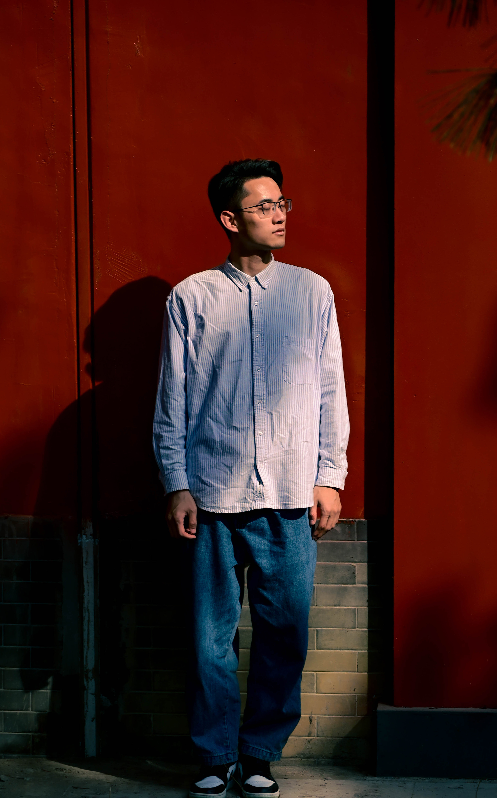

# About Me

 

  Here is **Naiyu Fang (房乃玉)**. 
- I was born in 1996 in Weifang, Shandong Province.
- I am a fifth-year PhD student majoring in Mechanical Engineering at [Zhejiang University](https://www.zju.edu.cn/english/), under the supervision of [Prof. Shuyou Zhang](https://person.zju.edu.cn/en/0092066) and [Prof. Lemiao Qiu](https://person.zju.edu.cn/en/english_my_freetown). Our research Group is affiliated to [the State Key Laboratory of Fluid Power & Mechatronic Systems](http://sklofp.zju.edu.cn/sklen/) and [State Key Lab of CAD&CG](http://www.cad.zju.edu.cn/english.html).

- My reserach interest focuses on __Computer Vision__, __Autonomous Driving__, and __Virtual Try-on__.  
- I will graduate at __June 2024__. Now, I'm looking for a __Postdoc__ position. My email is FangNaiyu@zju.edu.cn

 

## Education Experience

- **Sep 2019 - Present:** PhD candidate in Mechanical Engineering, [Zhejiang University](https://www.zju.edu.cn/english/)
- **Sep 2015 - June 2019:** B.Eng. in Mechanical Engineering, [Dalian University of Technology](https://en.dlut.edu.cn/)
- **Sep 2012 - June 2015:** General Senior High School, Zhucheng No. 1 Middle School.

 

---

## Research Interests

- Computer Vision
- Autonomous Driving
- Virtual Try-on

 

**-Visual-only autonomous driving upstream tasks:** It centered on the precision and efficiency issues in camera image-based perception of surrounding scenes. I have conducted the semantic segmentation task of vehicle and road on bird’s-eye view plane, and an efficiency-oriented cue fusion task for multi-frame monocular depth estimation.

**-Image-based virtual try-on visual tasks:** It revolved around visual realism and representation form issues. I have proposed a progressive pipeline of virtual try-on, a learning paradigm of garment transfer through cross-task knowledge
distillation, an unsupervised synthesis method of garment images, and an image sequence inference method via pose interpolation.

 

---

## News and Updates
- **Jan 2024:** One paper is accpeted to RAL.
- **Jan 2024:** One paper is accpeted to TMM.
- **Dec 2023:** One paper is accpeted to TITS.
- **Oct 2023:** Happy to be awarded the National Scholarship.
- **Dec 2022:** One paper is accpeted to PR.
- **Sep 2022:** One paper is accpeted to TMM.

 
